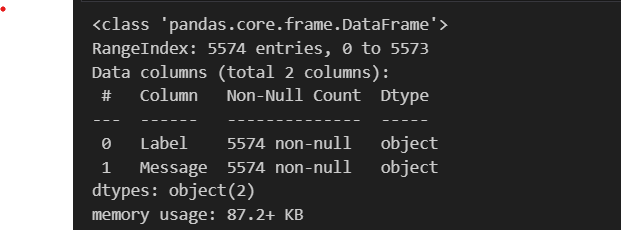
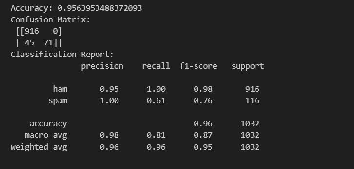

# Faza I: Përgatitja e modelit

Ky projekt në lendën: *Machine learning* përmban përshkrimin e fazës së parë të projektimit dhe përgatitjes së modelit për klasifikimin e mesazheve në 'ham' (mesazhe të dëshiruara) dhe 'spam' (mesazhe të padëshiruara), duke përdorur datasetin "SMS Spam Collection".

## Përshkrimi i detyrës

Në këtë fazë, ne merremi me përgatitjen e modelit për të klasifikuar mesazhet në dy kategori: 'ham' dhe 'spam'. Kjo përfshin:
- Leximin e të dhënave nga një burim,
- Pastrimin dhe përpunimin e të dhënave,
- Ndarjën e të dhënave në setin e trajnimit dhe testimit,
- Trajnimin e një modeli të mësimit të makinës për të bërë parashikime bazuar në përmbajtjen e mesazhit.

## Detajet e datasetit

Dataseti i përdorur është "SMS Spam Collection", i disponueshëm në:

[UCI Machine Learning Repository](https://archive.ics.uci.edu/dataset/228/sms+spam+collection)

Ky dataset përmban të paktën dy atribute:
- **Label**: Etiketa që tregon nëse një mesazh është 'ham' ose 'spam'.
- **Message**: Teksti i mesazhit që do të analizohet dhe klasifikohet.

## Instalimi i librave të nevojshme

Për të ekzekutuar skriptat e këtij projekti të Mësimit të Makinës për datasetin "SMS Spam Collection", është e nevojshme të instalohen disa librarive specifike të Python. Këto librarive përfshijnë:

- pandas
- scikit-learn

## Udhëzime për instalim

Ju mund të instaloni të gjitha varësitë e nevojshme përmes menaxherit të paketave `pip`. Ekzekutoni komandat e mëposhtme në terminalin ose command prompt tuaj për të instaluar secilën librari:

```
pip install pandas
pip install scikit-learn
```

## Algoritmet e klasifikimit

Për datasetin "SMS Spam Collection", ne mund të përdorim disa algoritme të ndryshme të klasifikimit për të ndarë mesazhet në "spam" dhe "ham". Këto algoritme përfshijnë:

### Naive Bayes
- **Përshtatshëm për**: Kur kemi datasete relativisht të vogla dhe duam një model që është i shpejtë dhe efektiv në kohën e tij të trajnimit.
- **Arsyeja e përdorimit**: Naive Bayes është një zgjedhje popullore për tekstual data si SMS për shkak të thjeshtësisë së tij dhe performancës së mirë me datasete me dimenzione të larta.

### Support Vector Machine (SVM)
- **Përshtatshëm për**: Kur kërkojmë një margin maksimal ndërmjet klasave dhe kemi një hapësirë të madhe karakteristikash.
- **Arsyeja e përdorimit**: SVM mund të jetë efektiv në rastet kur ka një ndarje të qartë mes klasave dhe kur hapësira e karakteristikave është e madhe, që është e zakonshme në analizën e tekstit.

### Random Forest
- **Përshtatshëm për**: Kur duam të zvogëlojmë rrezikun e overfitting dhe të trajtojmë mirë të dhënat jo-lineare.
- **Arsyeja e përdorimit**: Random Forest është një metodë e qëndrueshme që përdor një sërë pemësh vendimmarrëse për të rritur saktësinë e parashikimeve dhe për të menaxhuar mirë varësitë në të dhëna.

### Logistic Regression
- **Përshtatshëm për**: Rastet kur dëshirojmë një model probabilitetik që tregon gjasat e përkatësisë në një klasë.
- **Arsyeja e përdorimit**: Përdoret shpesh për probleme të klasifikimit binar siç është rasti me SMS spam dhe ham, ofron një mënyrë intuitive për të kuptuar rëndësinë e karakteristikave të ndryshme.

### Testimi i modelit

Për të vlerësuar performancën e modeleve të klasifikimit, ne mund të përdorim teknika të ndryshme të testimit, duke përfshirë:

- **Ndarja e të dhënave në setin e trajnimit dhe testimit**: Një pjesë e të dhënave (zakonisht rreth 70-80%) përdoret për të trajnuar modelin, ndërsa pjesa tjetër përdoret për të testuar performancën e tij.
- **Kryqëzimi i validimit (Cross-Validation)**: Përdoret për të vlerësuar aftësinë e generalizimit të një modeli të mësimit të makinës mbi një set të dhënash të padukshme.
- **Metrikat e performancës**: Përfshijnë saktësinë (accuracy), matricën e konfuzionit, precision, recall, dhe F1 score për të matur se sa mirë modeli mund të klasifikojë mesazhet.

Përdorimi i një kombinimi të këtyre metodave siguron një vlerësim të gjithanshëm të aftësisë së modelit për të parashikuar saktësisht kategoritë e mesazheve.


## Rezultatet e fazës së parë

Në fund të kësaj faze, pritet të kemi një skicë të qartë të procesit të trajnimit të modelit, duke përfshirë përgatitjen e të dhënave, zgjedhjen e modelit, dhe një vlerësim të parë të performancës së modelit në datasetin e testit.

### Struktura e datasetit

```
# Shfaqja e dataseti-it
printo_datasetin("Dataset-i", df)
```


### Njohuri mbi llojet e të dhënave
```
# Për të fituar njohuri mbi llojet e të dhënave ekzekutojmë këtë komandë:

df.info()
```


### Trajnimi dhe testimi i të dhënave

```
# Ndajmë të dhënat në trajnues dhe testim
X_train, X_test, y_train, y_test = train_test_split(df['Message'], df['Label'], test_size=0.2, random_state=42)

# Përdorimi i TF-IDF Vectorizer për të kthyer tekstet në një format të përpunueshëm numerik
vectorizer = TfidfVectorizer()
X_train_transformed = vectorizer.fit_transform(X_train)
X_test_transformed = vectorizer.transform(X_test)

# Trajnojmë modelin duke përdorur Naive Bayes
model = MultinomialNB()
model.fit(X_train_transformed, y_train)

# Parashikimi dhe vlerësimi i modelit
predictions = model.predict(X_test_transformed)
print("Accuracy:", accuracy_score(y_test, predictions))
print("Confusion Matrix:\n", confusion_matrix(y_test, predictions))
print("Classification Report:\n", classification_report(y_test, predictions))
```


# Kontributi
Vlora Gjoka

Sadik Zenuni
