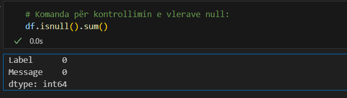
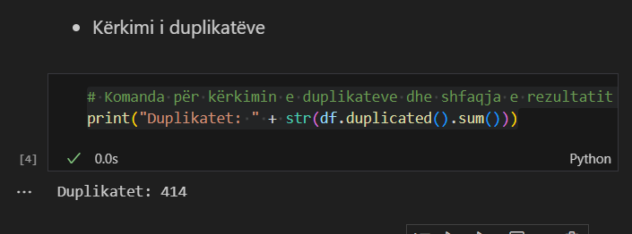
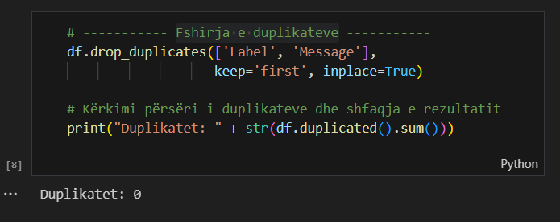
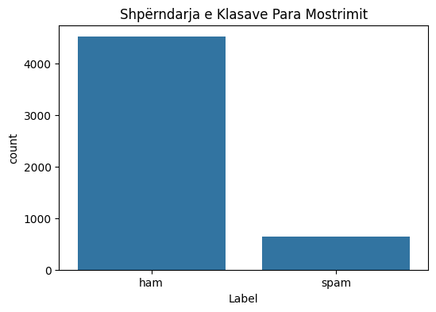
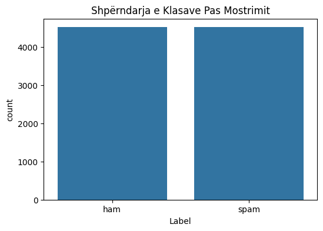
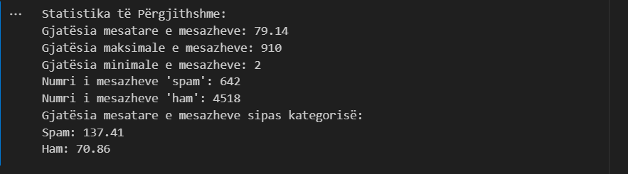
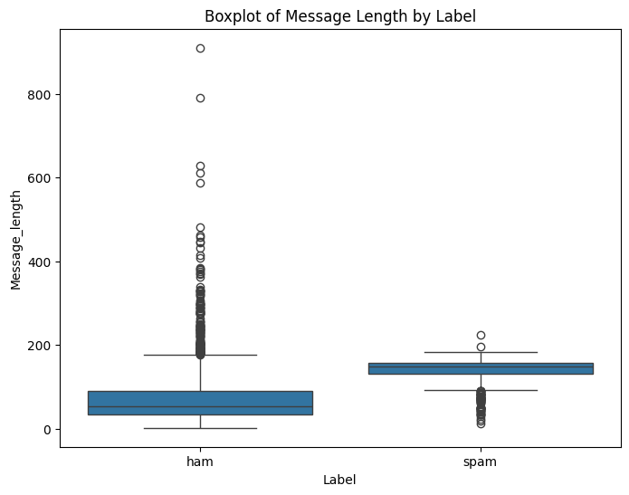
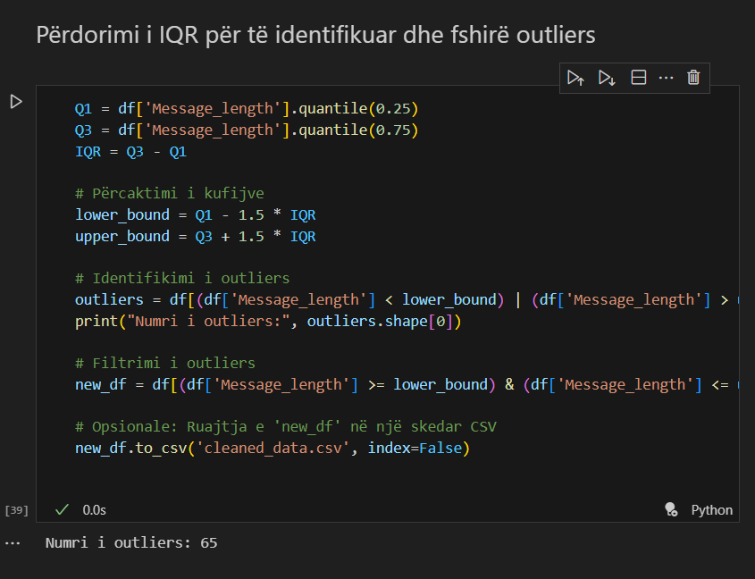
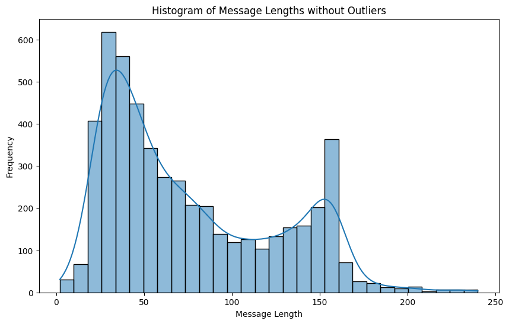
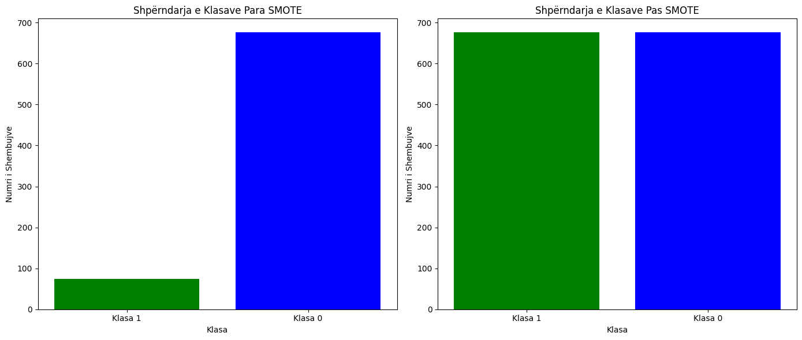

# SMS Spam Collection

**Universiteti:** Universiteti i Prishtinës  
**Fakulteti:** Fakulteti i Inxhinierisë Elektrike dhe Kompjuterike  
**Programi Studimor:** Master në Inxhinieri Kompjuterike dhe Softuerike

**Profesorët:**  
- Prof. Dr. Inxh. Lule Ahmedi
- PhD. c Mërgim Hoti

**Studentët:**  
- Vlora Gjoka
- Sadik Zenuni

## Përshkrimi i Projektit

Projekti në lëndën "Machine Learning" synon të trajtojë sfidën e klasifikimit të mesazheve të SMS në dy kategori: 'ham' (mesazhe të dëshiruara) dhe 'spam' (mesazhe të padëshiruara), duke përdorur datasetin "SMS Spam Collection".

### Fazat e Projektit

Projekti është ndarë në tri faza kryesore:

1. **Faza e parë: Përgatitja e Modelit**
   - Në këtë fazë, bëhet përgatitja e të dhënave dhe ndërtimi i modelit fillestar të machine learning për klasifikimin e mesazheve.
   
2. **Faza e dytë: Analiza dhe Evaluimi**
   - Pas trajnimit të modelit, zhvillohet një fazë e analizës së performancës dhe ritrajnimit të modelit bazuar në rezultatet e marra, për të arritur një saktësi më të lartë.
   
3. **Faza e tretë: Aplikimi i Veglave të Machine Learning**
   - Në fazën përfundimtare, aplikohen teknikat e avancuara të machine learning për të optimizuar dhe implementuar modelin në një mjedis të gjallë.

# Faza I: Përgatitja e Modelit

## Përshkrimi i detyrës

Në këtë fazë, ne merremi me përgatitjen e modelit për të klasifikuar mesazhet në dy kategori: 'ham' dhe 'spam'. Kjo përfshin:
- Leximin e të dhënave nga një burim,
- Pastrimin dhe përpunimin e të dhënave,

## Detajet e datasetit

Dataseti i përdorur është "SMS Spam Collection", i disponueshëm në:

[UCI Machine Learning Repository](https://archive.ics.uci.edu/dataset/228/sms+spam+collection)

Ky dataset përmban të paktën dy atribute:
- **Label**: Etiketa që tregon nëse një mesazh është 'ham' ose 'spam'.
- **Message**: Teksti i mesazhit që do të analizohet dhe klasifikohet.

## Instalimi i librave të nevojshme

Për të ekzekutuar skriptat e këtij projekti të Mësimit të Makinës për datasetin "SMS Spam Collection", është e nevojshme të instalohen disa librarive specifike të Python. Këto librarive përfshijnë:

- pandas
- scikit-learn
- numpy
- matplotlib.pyplot
- seaborn
- sklearn.model_selection
- sklearn.feature_extraction.text
- sklearn.naive_bayes
- sklearn.metrics
- sklearn.linear_model
- sklearn.svm
- sklearn.tree
- sklearn.utils
- sklearn.model_selection

## Udhëzime për instalim

Ju mund të instaloni të gjitha varësitë e nevojshme përmes menaxherit të paketave `pip`. Ekzekutoni komandat e mëposhtme në terminalin ose command prompt tuaj për të instaluar secilën librari:

```
pip install pandas
pip install scikit-learn
```
### Struktura e datasetit

```
# Shfaqja e dataseti-it
printo_datasetin("Dataset-i", df)
```


### Njohuri mbi llojet e të dhënave
```
# Për të fituar njohuri mbi llojet e të dhënave ekzekutojmë këtë komandë:

df.info()
```


### Menaxhimi vlerave null

```
# Komanda për kontrollimin e vlerave null:
df.isnull().sum()
```
- Në dataset-in tonë nuk ka kolona me vlera null.



### Menaxhimi i duplikateve:
```
# Komanda për kërkimin e duplikateve dhe shfaqja e rezultatit
print("Duplikatet: " + str(df.duplicated().sum()))
```
- Në dataset-in tonë i janë gjetur disa duplikate:


- Fshirja e duplikateve


### Mostrimi i të dhënave

#### Përpara Mostrimit

Fillimisht, analizuam shpërndarjen origjinale të klasave në datasetin tonë, i cili përfshin mesazhe të klasifikuara si 'ham' (dëshirueshme) dhe 'spam' (të padëshirueshme). Ky hap është thelbësor për të vlerësuar nevojën për mostrim.



#### Procesi i Mostrimit

Për të balancuar datasetin, ne kemi aplikuar *upsampling* në klasën me përfaqësim më të ulët ('spam'). Kjo përfshin zgjedhjen e rastësishme të rreshtave nga klasa e pakicës, me zëvendësim, derisa numri i rreshtave të saj të arrijë numrin e rreshtave në klasën e shumicës ('ham').

#### Pas Mostrimit

Pas përfundimit të procesit të mostrimit, ne kemi krijuar vizualizime të reja për të treguar shpërndarjen e re të balancuar të klasave. Kjo na lejon të vërtetojmë që dataseti tani është më i balancuar dhe i përshtatshëm për trajnimin e modeleve të mësimit të makinës.



### Agregimi i të dhënave

Në analizën tonë të datasetit "SMS Spam Collection", kemi përdorur agregime për të nxjerrë në pah disa statistika kyçe që ndihmojnë në kuptimin më të mirë të natyrës së të dhënave. Këto përfshijnë gjatësinë e mesazheve dhe shpërndarjen e klasave të mesazheve.

Statistikat e mëposhtme janë nxjerrë nga të dhënat:

- **Gjatësia mesatare e mesazheve**: Gjatësia mesatare e të gjithë mesazheve në dataset.
- **Gjatësia maksimale dhe minimale e mesazheve**: Tregon gjatësinë maksimale dhe minimale të mesazheve që janë regjistruar.
- **Numri i mesazheve 'Spam' dhe 'Ham'**: Tregon se sa mesazhe janë klasifikuar si spam dhe sa si ham.
- **Gjatësia mesatare e mesazheve sipas kategorisë**: Mesatarja e gjatësisë së mesazheve për secilën kategori, që jep një ide mbi karakteristikat e mesazheve spam dhe ham.

Këto të dhëna agreguese na ndihmojnë të përgatisim dhe rregullojmë më mirë modelet tona të mësimit të makinës për përmirësimin e saktësisë së klasifikimit të mesazheve.



### Menaxhimi i Outliers

Në datasetin "SMS Spam Collection", ne kemi analizuar dhe trajtuar outliers për të përmirësuar cilësinë e të dhënave për mësimin e makinës. Outliers mund të ndikojnë ndjeshëm në modelin përfundimtar dhe mund të çojnë në përfundime të pasakta.

#### Metodat e identifikimit

Outliers u identifikuan duke përdorur dy metoda kryesore:

- **Boxplots**: U përdorën për një analizë vizuale, duke na lejuar të shohim shpejt dhe lehtësisht ndonjë vlerë ekstreme në gjatësinë e mesazheve.
- **IQR Score**: Ne kemi përcaktuar vlerat ekstreme duke përdorur rangun ndërkartil të të dhënave, që është më pak i ndjeshëm ndaj outliers të ekstremeve.
- Paraqitja e Outliers



#### Trajtimi i Outliers


- Pastrimi i Outliers




### Aplikimi i SMOTE
```
# Inicializimi i SMOTE
sm = SMOTE(random_state=42)

# Aplikimi i SMOTE në të dhënat e trajnimit
X_train_res, y_train_res = sm.fit_resample(X_train, y_train)

# Llogaritja e shpërndarjes së klasave para dhe pas SMOTE
class_distribution_before = Counter(y_train)
class_distribution_after = Counter(y_train_res)

# Vizualizimi
fig, ax = plt.subplots(1, 2, figsize=(14, 6))

ax[0].bar(class_distribution_before.keys(), class_distribution_before.values(), color=['blue', 'green'])
ax[0].set_title('Shpërndarja e Klasave Para SMOTE')
ax[0].set_xlabel('Klasa')
ax[0].set_ylabel('Numri i Shembujve')
ax[0].set_xticks(list(class_distribution_before.keys()))
ax[0].set_xticklabels(['Klasa 0', 'Klasa 1'])

ax[1].bar(class_distribution_after.keys(), class_distribution_after.values(), color=['blue', 'green'])
ax[1].set_title('Shpërndarja e Klasave Pas SMOTE')
ax[1].set_xlabel('Klasa')
ax[1].set_ylabel('Numri i Shembujve')
ax[1].set_xticks(list(class_distribution_after.keys()))
ax[1].set_xticklabels(['Klasa 0', 'Klasa 1'])

plt.tight_layout()
plt.show()
```


# Faza 2: Trajnimi i Modelit

Në këtë fazë të projektit, qëllimi kryesor është të trajnojmë modele të ndryshme të mësimit të makinës për të parashikuar dhe klasifikuar mesazhet në baza të përmbajtjes së tyre si 'spam' ose 'jo spam'. Procesi përfshin ndarjen e të dhënave në sete trajnimi dhe testimi, zgjedhjen dhe konfigurimin e modeleve specifike të mësimit të makinës, dhe vlerësimin e performancës së tyre përmes metrikave të ndryshme si Saktësia, F1-score, Recall dhe Precision.

## Trajnimi dhe testimi i të dhënave

Ne ndajmë të dhënat në setin e trajnimit dhe testimit dhe trajnojmë modele të mësimit të makinës për të bërë parashikime bazuar në përmbajtjen e mesazhit.

## Testimi i Modelit

Për të vlerësuar performancën e modeleve të klasifikimit, përdorim teknika të ndryshme të testimit si:

- **Ndarja e të dhënave në setin e trajnimit dhe testimit**: Rreth 70-80% të të dhënave përdoren për trajnim, ndërsa pjesa tjetër për testim.
- **Kryqëzimi i Validimit (Cross-Validation)**: Vlerëson aftësinë e generalizimit të modelit në sete të dhënash të padukshme.
- **Metrikat e Performancës**: Përfshinë saktësinë, matricën e konfuzionit, precision, recall, dhe F1 score.

```python
# Ndajmë të dhënat në trajnues dhe testim
X_train, X_test, y_train, y_test = train_test_split(df['Message'], df['Label'], test_size=0.2, random_state=42)

# Përdorimi i TF-IDF Vectorizer për të kthyer tekstet në një format të përpunueshëm numerik
vectorizer = TfidfVectorizer()
X_train_transformed = vectorizer.fit_transform(X_train)
X_test_transformed = vectorizer.transform(X_test)

# Trajnojmë modelin duke përdorur Naive Bayes
model = MultinomialNB()
model.fit(X_train_transformed, y_train)

# Parashikimi dhe vlerësimi i modelit
predictions = model.predict(X_test_transformed)
print("Accuracy:", accuracy_score(y_test, predictions))
print("Confusion Matrix:\n", confusion_matrix(y_test, predictions))
print("Classification Report:\n", classification_report(y_test, predictions))
```


## Algoritmet e Klasifikimit

Për datasetin "SMS Spam Collection", eksplorojmë disa algoritme të klasifikimit:

### Naive Bayes
- **Përshtatshëm për**: Datasete të vogla me trajnim të shpejtë.
- **Arsyeja e Përdorimit**: Efikas për tekstin, ofron performancë të lartë në datasete me dimension të lartë.

### Support Vector Machine (SVM)
- **Përshtatshëm për**: Ndarje të qartë mes klasave, hapësirë të madhe të karakteristikave.
- **Arsyeja e Përdorimit**: Efektiv në raste me ndarje të qartë mes klasave.

### Random Forest
- **Përshtatshëm për**: Zvogëlimin e overfitting dhe menaxhimin e të dhënave jo-lineare.
- **Arsyeja e Përdorimit**: Metodë e qëndrueshme, përdor një ansambël pemësh vendimmarrëse.

### Logistic Regression
- **Përshtatshëm për**: Modele probabilitetike që tregojnë gjasat e përkatësisë në një klasë.
- **Arsyeja e Përdorimit**: Intuitive dhe shpesh përdoret për klasifikimin binar.

## Analiza e SMS Spam Collection

Projekti përfshin trajnimin dhe testimin e disa modeleve të mësimit të makinës për të parashikuar nëse një mesazh SMS është 'spam' apo 'ham' (jo spam).

### Përgatitja e të dhënave

Të dhënat u përpunuan duke përdorur `TfidfVectorizer` për të kthyer tekstet në formate numerike që mund të përpunohen nga modele të mësimit të makinës.

### Modelet e testuara

U testuan modelet e mëposhtme:
- Naive Bayes
- Logistic Regression
- Decision Tree Classifier
- Random Forest Classifier
- Support Vector Machine
- K Neighbors

### Ndarja e të dhënave

Të dhënat u ndanë në sete trajnimi dhe testimi me ndarje të ndryshme si 40/60, 30/70, 20/80, dhe 10/90 për të vlerësuar ndikimin e madhësisë së setit të trajnimit në performancën e modelit.


### Rezultatet e vlerësimit të modeleve të klasifikimit të mesazheve SMS

Tabelat e mëposhtme përmbajnë rezultatet e vlerësimit të modeleve të ndryshëm të klasifikimit duke përdorur ndarje të ndryshme të të dhënave për trajnim dhe testim. Vlerësimi është bërë duke përdorur matricat: saktësinë (Accuracy), F1-score, Recall dhe Precision.

#### Rezultatet me ndarjen e të dhënave 60/40

| Model                | Accuracy | F1-score | Recall | Precision |
|----------------------|----------|----------|--------|-----------|
| Logistic Regression  | 0.95     | 0.72     | 0.57   | 0.99      |
| Decision Tree        | 0.96     | 0.84     | 0.82   | 0.85      |
| Random Forest        | 0.97     | 0.88     | 0.78   | 0.99      |
| Support Vector Machine| 0.98    | 0.89     | 0.82   | 0.98      |
| K Neighbors          | 0.90     | 0.26     | 0.15   | 1.00      |

#### Rezultatet me ndarjen e të dhënave 70/30

| Model                | Accuracy | F1-score | Recall | Precision |
|----------------------|----------|----------|--------|-----------|
| Logistic Regression  | 0.95     | 0.73     | 0.58   | 0.97      |
| Decision Tree        | 0.95     | 0.80     | 0.81   | 0.78      |
| Random Forest        | 0.98     | 0.88     | 0.79   | 0.99      |
| Support Vector Machine| 0.98    | 0.89     | 0.83   | 0.95      |
| K Neighbors          | 0.91     | 0.31     | 0.19   | 1.00      |

#### Rezultatet me ndarjen e të dhënave 80/20

| Model                | Accuracy | F1-score | Recall | Precision |
|----------------------|----------|----------|--------|-----------|
| Logistic Regression  | 0.96     | 0.78     | 0.65   | 0.97      |
| Decision Tree        | 0.96     | 0.80     | 0.80   | 0.80      |
| Random Forest        | 0.97     | 0.86     | 0.77   | 0.99      |
| Support Vector Machine| 0.98    | 0.89     | 0.83   | 0.96      |
| K Neighbors          | 0.91     | 0.34     | 0.21   | 1.00      |

#### Rezultatet me ndarjen e të dhënave 90/10

| Model                | Accuracy | F1-score | Recall | Precision |
|----------------------|----------|----------|--------|-----------|
| Logistic Regression  | 0.96     | 0.79     | 0.66   | 0.97      |
| Decision Tree        | 0.97     | 0.84     | 0.81   | 0.88      |
| Random Forest        | 0.98     | 0.88     | 0.79   | 1.00      |
| Support Vector Machine| 0.98    | 0.91     | 0.85   | 0.98      |
| K Neighbors          | 0.92     | 0.34     | 0.21   | 1.00      |

# Faza 3: Analiza dhe evaluimi (Ritrajnimi)

Në fazën e tretë të projektit, fokusohemi në optimizimin dhe zbatimin praktik të modelit të mësimit të makinës që është zhvilluar dhe testuar në fazat e mëparshme. Ky proces përfshin përmirësimin e modelit përmes zgjerimit të feature engineering, optimizimit të hiperparametrave, dhe testimit të modelit në mjedise të ndryshme.

## Procesi
### 1. Zgjerimi i Feature Engineering
- Implementimi i teknikave të avancuara si TF-IDF dhe analiza e sentimentit për të përmirësuar dallimin midis mesazheve 'spam' dhe 'ham'.

## Karakteristikat

- **Pastrimi i të dhënave**: Pastrim të gjithanshëm dhe përpunim paraprak të tekstit për të përmirësuar saktësinë e modelit është bërë në fazën e parë.
- **Inxhinieri e Karakteristikave**: Përdorimi i TfidfVectorizer për të transformuar mesazhet e tekstit në forma numerike që mund të përpunohen nga modelet e mësimit të makinës.
- **Trajnimi dhe Optimizimi i Modelit**: Përdorimi i  RandomForestClassifier së bashku me GridSearchCV për të gjetur kombinimin më të mirë të parametrave për modelin.

-  **Ngarkimi dhe pastrimi i të dhënave**: Të dhënat ngarkohen dhe pastrohen për çdo gabim ose vlerë të munguar.
- **Përgatitja e karakteristikave**: Teksti konvertohet në vektorë numerikë duke përdorur teknikat e Tfidf.
- **Ndajtja e të dhënave**: Të dhënat ndahen në sete trajnimi dhe testimi për të vlerësuar modelin.
-  **Optimizimi i modelit**: Parametrat e modelit optimizohen për të arritur performancën më të lartë.
-  **Vlerësimi i modelit**: Modeli vlerësohet në bazë të saktësisë, raportit të klasifikimit dhe matricës së konfuzionit.

### 2. Trajnimi dhe Optimizimi i Modeleve të Avancuara
- Testimi i modeleve të ndryshme të mësimit të thellë si CNN dhe RNN.
- Përdorimi i Grid Search dhe Randomized Search për të gjetur konfigurimet optimale të parametrave.

### 3. Vlerësimi dhe Validimi i Modelit
- Implementimi i k-fold cross-validation për të siguruar që modeli ka performancë të qëndrueshme.
- Analiza e metrikave të performancës si saktësia, precision, recall dhe F1-score.

### 4. Implementimi dhe Testimi Praktik
- Zbatimi i modelit në aplikacione reale dhe monitorimi i performancës së tij në kushte të ndryshme.

## Përfundimi

Faza e tretë përfundon me një model të optimizuar dhe të gatshëm për t'u zbatuar në skenarë të ndryshëm realë, duke siguruar një zgjidhje efektive për dallimin e mesazheve spam nga ato të dëshiruara. Kjo fazë kontribuon në rritjen e efikasitetit dhe saktësisë së sistemeve automatike të filtrimit të mesazheve.