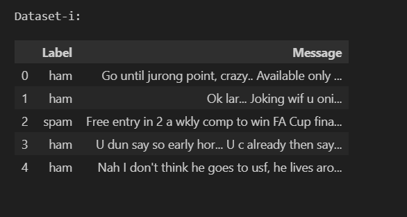

# SMS Spam Collection

**Universiteti:** Universiteti i Prishtinës  
**Fakulteti:** Fakulteti i Inxhinierisë Elektrike dhe Kompjuterike  
**Programi Studimor:** Master në Inxhinieri Kompjuterike dhe Softuerike

**Profesorët:**  
- Prof. Dr. Inxh. Lule Ahmedi
- PhD. c Mërgim Hoti

**Studentët:**  
- Vlora Gjoka
- Sadik Zenuni

## Përshkrimi i Projektit

Projekti në lëndën "Machine Learning" synon të trajtojë sfidën e klasifikimit të mesazheve të SMS në dy kategori: 'ham' (mesazhe të dëshiruara) dhe 'spam' (mesazhe të padëshiruara), duke përdorur datasetin "SMS Spam Collection".

### Fazat e Projektit

Projekti është ndarë në tri faza kryesore:

1. **Faza e parë: Përgatitja e Modelit**
   - Në këtë fazë, bëhet përgatitja e të dhënave dhe ndërtimi i modelit fillestar të machine learning për klasifikimin e mesazheve.
   
2. **Faza e dytë: Analiza dhe Evaluimi**
   - Pas trajnimit të modelit, zhvillohet një fazë e analizës së performancës dhe ritrajnimit të modelit bazuar në rezultatet e marra, për të arritur një saktësi më të lartë.
   
3. **Faza e tretë: Aplikimi i Veglave të Machine Learning**
   - Në fazën përfundimtare, aplikohen teknikat e avancuara të machine learning për të optimizuar dhe implementuar modelin në një mjedis të gjallë.

# Faza I: Përgatitja e Modelit

## Përshkrimi i detyrës

Në këtë fazë, ne merremi me përgatitjen e modelit për të klasifikuar mesazhet në dy kategori: 'ham' dhe 'spam'. Kjo përfshin:
- Leximin e të dhënave nga një burim,
- Pastrimin dhe përpunimin e të dhënave,

## Detajet e datasetit

Dataseti i përdorur është "SMS Spam Collection", i disponueshëm në:

[UCI Machine Learning Repository](https://archive.ics.uci.edu/dataset/228/sms+spam+collection)

Ky dataset përmban të paktën dy atribute:
- **Label**: Etiketa që tregon nëse një mesazh është 'ham' ose 'spam'.
- **Message**: Teksti i mesazhit që do të analizohet dhe klasifikohet.

## Instalimi i librave të nevojshme

Për të ekzekutuar skriptat e këtij projekti të Mësimit të Makinës për datasetin "SMS Spam Collection", është e nevojshme të instalohen disa librarive specifike të Python. Këto librarive përfshijnë:

- pandas
- scikit-learn

## Udhëzime për instalim

Ju mund të instaloni të gjitha varësitë e nevojshme përmes menaxherit të paketave `pip`. Ekzekutoni komandat e mëposhtme në terminalin ose command prompt tuaj për të instaluar secilën librari:

```
pip install pandas
pip install scikit-learn
```

## Rezultatet e fazës së parë

Në fund të kësaj faze, pritet të kemi një skicë të qartë të procesit të trajnimit të modelit, duke përfshirë përgatitjen e të dhënave, zgjedhjen e modelit, dhe një vlerësim të parë të performancës së modelit në datasetin e testit.

### Struktura e datasetit

```
# Shfaqja e dataseti-it
printo_datasetin("Dataset-i", df)
```


### Njohuri mbi llojet e të dhënave
```
# Për të fituar njohuri mbi llojet e të dhënave ekzekutojmë këtë komandë:

df.info()
```


# Faza 2: Trajnimi i Modelit

## Trajnimi dhe Testimi i të Dhënave

Në këtë fazë, ne ndajmë të dhënat në setin e trajnimit dhe testimit dhe trajnojmë një model të mësimit të makinës për të bërë parashikime bazuar në përmbajtjen e mesazhit.

## Testimi i Modelit

Për të vlerësuar performancën e modeleve të klasifikimit, përdorim teknika të ndryshme të testimit si:

- **Ndarja e të dhënave në setin e trajnimit dhe testimit**: Rreth 70-80% të të dhënave përdoren për trajnim, ndërsa pjesa tjetër për testim.
- **Kryqëzimi i Validimit (Cross-Validation)**: Vlerëson aftësinë e generalizimit të modelit në sete të dhënash të padukshme.
- **Metrikat e Performancës**: Përfshinë saktësinë, matricën e konfuzionit, precision, recall, dhe F1 score.

```python
# Ndajmë të dhënat në trajnues dhe testim
X_train, X_test, y_train, y_test = train_test_split(df['Message'], df['Label'], test_size=0.2, random_state=42)

# Përdorimi i TF-IDF Vectorizer për të kthyer tekstet në një format të përpunueshëm numerik
vectorizer = TfidfVectorizer()
X_train_transformed = vectorizer.fit_transform(X_train)
X_test_transformed = vectorizer.transform(X_test)

# Trajnojmë modelin duke përdorur Naive Bayes
model = MultinomialNB()
model.fit(X_train_transformed, y_train)

# Parashikimi dhe vlerësimi i modelit
predictions = model.predict(X_test_transformed)
print("Accuracy:", accuracy_score(y_test, predictions))
print("Confusion Matrix:\n", confusion_matrix(y_test, predictions))
print("Classification Report:\n", classification_report(y_test, predictions))
```


## Algoritmet e Klasifikimit

Për datasetin "SMS Spam Collection", eksplorojmë disa algoritme të klasifikimit:

### Naive Bayes
- **Përshtatshëm për**: Datasete të vogla me trajnim të shpejtë.
- **Arsyeja e Përdorimit**: Efikas për tekstin, ofron performancë të lartë në datasete me dimension të lartë.

### Support Vector Machine (SVM)
- **Përshtatshëm për**: Ndarje të qartë mes klasave, hapësirë të madhe të karakteristikave.
- **Arsyeja e Përdorimit**: Efektiv në raste me ndarje të qartë mes klasave.

### Random Forest
- **Përshtatshëm për**: Zvogëlimin e overfitting dhe menaxhimin e të dhënave jo-lineare.
- **Arsyeja e Përdorimit**: Metodë e qëndrueshme, përdor një ansambël pemësh vendimmarrëse.

### Logistic Regression
- **Përshtatshëm për**: Modele probabilitetike që tregojnë gjasat e përkatësisë në një klasë.
- **Arsyeja e Përdorimit**: Intuitive dhe shpesh përdoret për klasifikimin binar.


# Kontributi
Vlora Gjoka

Sadik Zenuni
